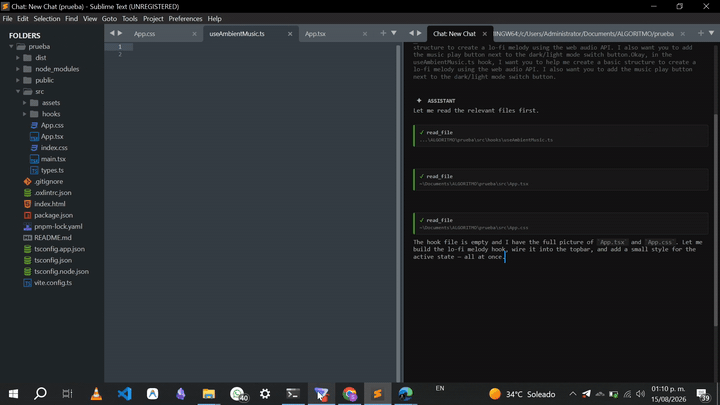
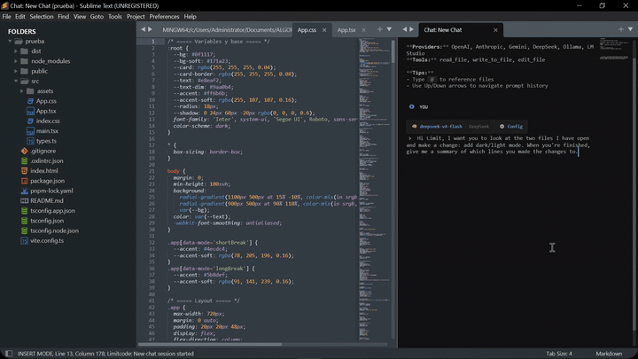

# Limitcode

**Limitcode is an AI pair programming agent for Sublime Text.**

It works the way a pair programmer works: the agent only sees and touches the
files you have open in your editor. You steer the session, you choose what it
reads, and every edit lands in a file you can review immediately.

No hidden filesystem scans. No shell access. No autopilot.

## Why pair programming

Limitcode exposes exactly three tools:

- `read_file`
- `write_to_file`
- `edit_file`

These tools can only operate on files that already have a path and are open in
the active Sublime Text window. Closed files cannot be read or modified, and
`write_to_file` cannot create new files.

That constraint is the product: the agent works *with* you, inside the code you
show it, one step at a time. If you want an autonomous agent that searches the
project, runs commands, and manages its own context, see
<a href="#limitcode-pro">Limitcode Pro</a>.

## Features

- Side-by-side streaming chat inside Sublime Text
- Persistent conversation history per session
- Model and provider selection with per-session control
- Configurable reasoning effort and visible thinking
- Prompt history and @-file references
- A deliberately small, reviewable tool surface

## LSP integration (optional)

If you have the [LSP](https://packagecontrol.io/packages/LSP) package installed,
Limitcode will use its diagnostics after each edit to give the agent feedback on
syntax and type errors, so it can catch and fix issues before continuing. This
is optional and automatic — it only activates if LSP is already installed.

## Providers

Limitcode supports:

- OpenAI
- DeepSeek
- Anthropic
- Gemini
- OpenRouter
- Moonshot AI (Kimi)
- Ollama
- LM Studio

Ollama and LM Studio run locally without an API key. Cloud providers require a
key configured through `Limitcode: Setup Provider API Key` or the `api_keys`
object in `Limitcode.sublime-settings`. Model lists are fetched live from each
provider's `/models` endpoint (with a cached fallback), so new models appear
automatically.

## Quick start

1. Place the repository in Sublime Text's `Packages/Limitcode` directory.
2. Restart Sublime Text.
3. Run `Limitcode: Setup Provider API Key` from the Command Palette.
4. Run `Limitcode: Open Chat` from the Command Palette.

Open every file you want the agent to read or edit before sending a request.

## Demo





Watch Limitcode build a Pomodoro timer app end to end — including the lo-fi melody it composed and exported as an audio file.

## A typical session

1. Open the file you want to work on.
2. Select the code you care about and run `Limitcode: Send to Agent`, or just
   describe the change in the chat.
3. Review the edit the agent applies to your open file.
4. Ask for adjustments, or move on.

The agent never leaves the files you opened, and it never runs commands on
your machine.

## Commands

- `Limitcode: Open Chat`
- `Limitcode: New Chat`
- `Limitcode: Chat History`
- `Limitcode: Rename Session`
- `Limitcode: Delete Session`
- `Limitcode: Send to Agent`
- `Limitcode: Change Provider`
- `Limitcode: Change Model`
- `Limitcode: Increase Chat Font Size`
- `Limitcode: Decrease Chat Font Size`
- `Limitcode: Reset Chat Font Size`
- `Limitcode: Set Reasoning Effort`
- `Limitcode: Toggle Show Thoughts`
- `Limitcode: Setup Provider API Key`
- `Limitcode: Open Settings`
- `Limitcode: Open Key Bindings`
- `Limitcode: Clear Chat`
- `Limitcode: Cancel Active Response`
- `Limitcode: Stop Agent`

## Keyboard shortcuts

Limitcode does not claim global shortcuts when installed. Inside the chat,
`Enter`, `Shift+Enter`, `Escape`, `Up`, and `Down` are context-specific controls.

To add your own global shortcuts, run `Limitcode: Open Key Bindings` and place
bindings in the user pane. For example:

```json
[
    { "keys": ["ctrl+alt+l"], "command": "limitcode_open_chat" },
    { "keys": ["ctrl+alt+a"], "command": "limitcode_send_to_agent" },
    { "keys": ["ctrl+alt+x"], "command": "limitcode_cancel_request" }
]
```

### Optional chat font shortcuts

The chat has its own font size and does not change the editor font size. It is
disabled by default in the configuration with `"chat_font_size": "auto"`, which
makes the chat inherit Sublime's global `font_size`.

To use a fixed size, add a numeric value to the user settings:

```json
{
    "chat_font_size": 11
}
```

The `Increase Chat Font Size`, `Decrease Chat Font Size`, and `Reset Chat Font
Size` commands are available from the Command Palette. They only work when the
Limitcode chat view is active and save the selected chat size for future chats.

Limitcode does not assign `Ctrl+Plus` or `Ctrl+Minus` by default. To add your
own shortcuts, use `Limitcode: Open Key Bindings` and add bindings such as:

```json
[
    {
        "keys": ["ctrl+="],
        "command": "limitcode_increase_chat_font_size",
        "context": [
            { "key": "setting.limitcode_chat_view", "operator": "equal", "operand": true }
        ]
    },
    {
        "keys": ["ctrl+-"],
        "command": "limitcode_decrease_chat_font_size",
        "context": [
            { "key": "setting.limitcode_chat_view", "operator": "equal", "operand": true }
        ]
    }
]
```

## Configuration

```json
{
    "default_provider": "openai",
    "default_model": "gpt-5.5",
    "api_keys": {
        "openai": ""
    },
    "provider_base_urls": {},
    "temperature": "auto",
    "max_tokens": 8192,
    "max_iterations": 50,
    "chat_font_size": "auto",
    "reasoning_effort": "off",
    "show_thoughts": false
}
```

`temperature` accepts `"auto"` or a number. `max_tokens` accepts a positive
integer or `"auto"`. Reasoning effort can be `off`, `low`, `medium` or `high`;
unsupported models ignore it. `chat_font_size` accepts `"auto"` or a positive
number and applies only to the Limitcode chat view.

## Chat style customization

The chat status bar can follow your Sublime Text theme without changing the
rest of the editor.

### Quick option: `chat_style`

Adjust only what you need in `Limitcode.sublime-settings`:

```json
"chat_style": {
    "chip_background": "",
    "chip_border": "",
    "chip_text": "",
    "link_color": "",
    "muted_text": "",
    "muted_opacity": 0.4,
    "chip_radius": 4,
    "chip_padding": "3px 9px"
}
```

| Option | What it controls |
| --- | --- |
| `chip_background` | Chip background |
| `chip_border` | Border color |
| `chip_text` | Chip text color |
| `link_color` | Link color (model, mode, config) |
| `muted_text` | Secondary text color (provider) |
| `muted_opacity` | Secondary text opacity (`0` to `1`) |
| `chip_radius` | Corner radius |
| `chip_padding` | Inner padding of the chip |

Empty values inherit the active theme.

Example for dark themes with low contrast:

```json
"chat_style": {
    "link_color": "#ffcc66",
    "muted_opacity": 0.8,
    "chip_radius": 3
}
```

### Advanced option: `chat.css`

Create `Packages/User/Limitcode/chat.css` to override anything not exposed in
the settings:

```css
#limitcode-status {
    --limitcode-chip-background: #252a34;
    --limitcode-chip-border: #88c0d0;
    --limitcode-chip-link: #ffcc66;
    --limitcode-chip-muted: #c8d3e0;
}

#limitcode-status .chip {
    border-radius: 6px;
}
```

The file belongs to the user and is not overwritten on updates.

Priority order:

```text
Package base CSS
      |
      v
chat_style (settings)
      |
      v
Packages/User/Limitcode/chat.css
```

## Limitcode Pro

<a href="https://limitcode.jawuil.dev/?utm_source=github&utm_medium=readme" target="_blank" rel="noopener">Limitcode Pro</a>

Limitcode Pro is the fully autonomous version of Limitcode. It keeps the same
editor-native workflow and adds:

- Project-wide file listing, searching, and targeted edits
- Approved shell command execution
- Web search and page fetching
- Reusable skills and MCP server connections
- Focused subagents and batched workflows
- Account sign-in for GitHub Copilot, OpenAI Codex, and Google Antigravity
- Automatic context compaction and snapshot-based undo/redo
- License-gated activation on up to three devices

Pro runs entirely inside Sublime Text with a configurable permission model, and
is distributed as a packaged release rather than source.

Pro users can report bugs and suggestions here too, or by email. If you open an
issue, add the `[Pro]` tag to the end of the title so Pro reports are easy to
tell apart from the OSS ones.

## Feedback and issues

Have a comment, question, suggestion or bug report? Open an issue in this
repository — it is the preferred place for anything reproducible and public.
You can also reach out by email if you prefer.

If your report is about Limitcode Pro, add the `[Pro]` tag to the end of the
title (for example, `Too many logs in console! [Pro]`) so Pro and OSS issues
are easy to tell apart.

```text
hola@jawuil.dev
```

Please do not paste provider API keys or tokens, personal data, or logs and
screenshots that contain your own code, prompts or file paths. For anything
sensitive, use email instead.

## Development

Run the test suite from the repository root:

```powershell
python -B -m unittest discover -s tests -p "test_*.py"
```

## License

Licensed under the GNU General Public License, Version 3. See
[LICENSE](LICENSE).
